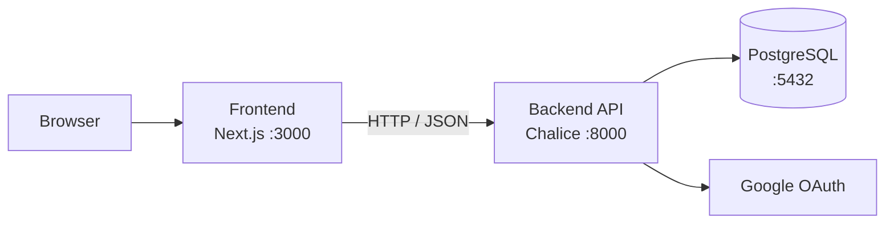

<div align="center">

# GUNDAM UNIVERSE BOARD

**A full-stack community platform with a Gundam Universal Century theme**

*A personal toy project built during a university vacation for learning purposes*

<br />

[](https://github.com/salieri009/ToyProject-Gundam/actions/workflows/ci.yml)
[](https://github.com/salieri009/ToyProject-Gundam/releases)
[](LICENSE)

<br />

[](https://nodejs.org)
[](https://www.python.org)
[](https://nextjs.org)
[](https://www.typescriptlang.org)
[](https://tailwindcss.com)
[](https://www.postgresql.org)
[](https://aws.amazon.com/lambda/)
[](https://docs.docker.com/compose/)

<br />

[한국어](README.md) · **English** · [日本語](README.ja.md)

</div>

---

## Table of Contents

- [Overview](#overview)
- [Features](#features)
- [Tech Stack](#tech-stack)
- [Architecture](#architecture)
- [Project Structure](#project-structure)
- [Quick Start](#quick-start)
- [Environment Variables](#environment-variables)
- [Docker](#docker)
- [Documentation](#documentation)
- [Deployment](#deployment)
- [Release](#release)
- [Package](#package)
- [License](#license)

---

## Overview

A personal toy project built during a university vacation for learning purposes.

GUNDAM UNIVERSE BOARD is a community application covering post creation, comments, authentication, and permission management. The frontend and backend are decoupled; the API and data model are managed alongside their documentation.

---

## Features

| Feature | Description |
|---|---|
| 🔐 **Google OAuth Login** | Sign in with Google account |
| 🔑 **JWT Auth** | Access token (24h) + refresh token (30d) with auto-renewal |
| 📝 **Post CRUD** | Create, read (paginated), update, delete |
| 💬 **Nested Comments** | Comments with 1-level nested replies |
| 🛡️ **Permission Control** | Only authors can edit or delete their own content |
| 📱 **Responsive UI** | Next.js App Router + Tailwind CSS |

---

## Tech Stack

### Frontend

| Item | Technology | Version |
|---|---|---|
| Framework | Next.js (App Router) | 14 |
| Language | TypeScript | 5 |
| Styling | Tailwind CSS | 3 |
| HTTP Client | Axios | 1.6 |
| Auth | @react-oauth/google | 0.12 |
| Forms | React Hook Form + Zod | 7 / 3 |

### Backend

| Item | Technology | Version |
|---|---|---|
| Framework | AWS Chalice | 1.29 |
| Language | Python | 3.13 |
| ORM | SQLAlchemy + psycopg2 | 2.0 |
| Auth | PyJWT + google-auth | 2.8 / 2.23 |

### Infrastructure

| Item | Technology |
|---|---|
| Database | PostgreSQL 15 |
| Container | Docker + Docker Compose |
| CI/CD | GitHub Actions |
| Registry | GitHub Container Registry (GHCR) |
| Cloud | AWS Lambda + API Gateway |

---

## Architecture



**Authentication Flow**

```
1. User → Google OAuth login
2. Backend → issues JWT access token (24h) + refresh token (30d)
3. Frontend → Axios interceptor automatically injects Bearer token on every request
4. Token expiry → /auth/refresh called automatically → new access token issued
5. Logout → client-side token deletion + refresh token invalidation
```

---

## Project Structure

```
ToyProject-Gundam/
├── backend/                    # AWS Chalice backend
│   ├── app.py                  # Application entry point
│   ├── requirements.txt
│   ├── Dockerfile
│   ├── .env.example
│   └── chalicelib/
│       ├── config.py           # Environment config and CORS
│       ├── database.py         # SQLAlchemy session management
│       ├── auth/
│       │   ├── google.py       # Google OAuth token verification
│       │   ├── tokens.py       # JWT encode / decode
│       │   └── middleware.py   # @require_auth decorator
│       ├── models/             # SQLAlchemy ORM models
│       ├── routes/             # API endpoint handlers
│       ├── serializers/        # Response formatting
│       └── utils/              # Pagination, validation
├── frontend/                   # Next.js frontend
│   ├── Dockerfile
│   ├── .env.local.example
│   └── src/
│       ├── app/                # App Router pages
│       ├── components/         # Reusable UI components
│       ├── hooks/useAuth.ts    # Auth state hook
│       ├── services/api.ts     # Axios client + interceptors
│       └── types/index.ts      # TypeScript interfaces
├── docs/                       # Design and API documentation
├── docker-compose.yml
└── .github/
    ├── workflows/ci.yml        # Lint · build CI
    └── workflows/release.yml   # Release · image publish
```

---

## Quick Start

### Requirements

- Node.js 22 or higher
- Python 3.13 or higher
- PostgreSQL 15 or higher
- Google OAuth client ID / secret

### 1. Backend

```bash
cd backend
python -m venv venv
source venv/bin/activate        # Windows: .\venv\Scripts\Activate.ps1
pip install -r requirements.txt
cp .env.example .env
# Fill in DATABASE_URL, JWT_SECRET, GOOGLE_CLIENT_ID, GOOGLE_CLIENT_SECRET
chalice local --port 8000
```

### 2. Frontend

```bash
cd frontend
npm install
cp .env.local.example .env.local
# Fill in NEXT_PUBLIC_API_URL, NEXT_PUBLIC_GOOGLE_CLIENT_ID
npm run dev
```

### 3. Access

| Service | URL |
|---|---|
| Frontend | http://localhost:3000 |
| Backend | http://localhost:8000 |

> For full setup instructions, see [docs/LOCAL_SETUP_GUIDE.en.md](docs/LOCAL_SETUP_GUIDE.en.md).

---

## Environment Variables

### `backend/.env`

| Variable | Required | Description |
|---|:---:|---|
| `DATABASE_URL` | ✅ | PostgreSQL connection string |
| `JWT_SECRET` | ✅ | JWT signing key (use a long random string) |
| `GOOGLE_CLIENT_ID` | ✅ | Google OAuth client ID |
| `GOOGLE_CLIENT_SECRET` | ✅ | Google OAuth client secret |
| `CORS_ALLOWED_ORIGINS` | | Comma-separated allowed origins (default: `http://localhost:3000`) |

### `frontend/.env.local`

| Variable | Required | Description |
|---|:---:|---|
| `NEXT_PUBLIC_API_URL` | ✅ | Backend API base URL |
| `NEXT_PUBLIC_GOOGLE_CLIENT_ID` | ✅ | Google client ID for login |

---

## Docker

Run the full stack (PostgreSQL + Backend + Frontend) in one command.

```bash
# Build and start
docker compose up --build

# Background mode
docker compose up -d --build

# Stop
docker compose down
```

| Service | URL |
|---|---|
| Frontend | http://localhost:3000 |
| Backend API | http://localhost:8000 |
| PostgreSQL | localhost:5432 |

> The backend exposes a `/health` endpoint. The frontend waits for the backend to be healthy before starting.

Override environment variables before running:

```bash
JWT_SECRET=your-secret \
GOOGLE_CLIENT_ID=your-client-id \
NEXT_PUBLIC_GOOGLE_CLIENT_ID=your-client-id \
docker compose up --build
```

---

## Documentation

| Document | Description |
|---|---|
| [docs/LOCAL_SETUP_GUIDE.en.md](docs/LOCAL_SETUP_GUIDE.en.md) | Full local setup guide |
| [docs/01_API_Design.md](docs/01_API_Design.md) | REST API spec (endpoints, request/response) |
| [docs/02_Database_Design.md](docs/02_Database_Design.md) | Database schema and relationships |
| [docs/03_Frontend_Architecture.md](docs/03_Frontend_Architecture.md) | Component structure and state management |
| [docs/04_Backend_Architecture.md](docs/04_Backend_Architecture.md) | Backend layers, routes, middleware |
| [docs/05_UI_UX_Design.md](docs/05_UI_UX_Design.md) | CRT retro theme UI/UX guide |
| [docs/ENGINEERING_AUDIT_REPORT.md](docs/ENGINEERING_AUDIT_REPORT.md) | Code audit report |

---

## Deployment

Deploy to AWS Lambda + API Gateway via Chalice.

```bash
cd backend
chalice deploy --stage dev   # development
chalice deploy --stage prod  # production
```

> Configure environment variables, logging, monitoring, and backup policies separately before a production deploy.

---

## Release

[](https://github.com/salieri009/ToyProject-Gundam/releases)

Pushing a `v*` tag triggers [`.github/workflows/release.yml`](.github/workflows/release.yml) automatically.

```bash
git tag v1.0.0
git push origin v1.0.0
```

**What happens automatically**

- GitHub Release is created with auto-generated release notes and `docker-compose.yml` attached
- Backend and frontend Docker images are built and published to GHCR

---

## Package

[](https://github.com/salieri009/ToyProject-Gundam/pkgs/container/toyproject-gundam-backend)
[](https://github.com/salieri009/ToyProject-Gundam/pkgs/container/toyproject-gundam-frontend)

Container images are published to [GitHub Container Registry](https://ghcr.io).

| Image | Tags |
|---|---|
| `ghcr.io/salieri009/toyproject-gundam-backend` | `latest`, `v1.0.0` |
| `ghcr.io/salieri009/toyproject-gundam-frontend` | `latest`, `v1.0.0` |

**Pull images**

```bash
docker pull ghcr.io/salieri009/toyproject-gundam-backend:latest
docker pull ghcr.io/salieri009/toyproject-gundam-frontend:latest
```

**Run with pre-built images** — replace the `build:` blocks in `docker-compose.yml` with `image:`:

```yaml
backend:
  image: ghcr.io/salieri009/toyproject-gundam-backend:latest

frontend:
  image: ghcr.io/salieri009/toyproject-gundam-frontend:latest
```

> The frontend image has `NEXT_PUBLIC_API_URL=http://localhost:8000` baked in at build time. A custom build is required when deploying to a different domain.

---

## License

This project is licensed under the MIT License. See [LICENSE](LICENSE) for details.
