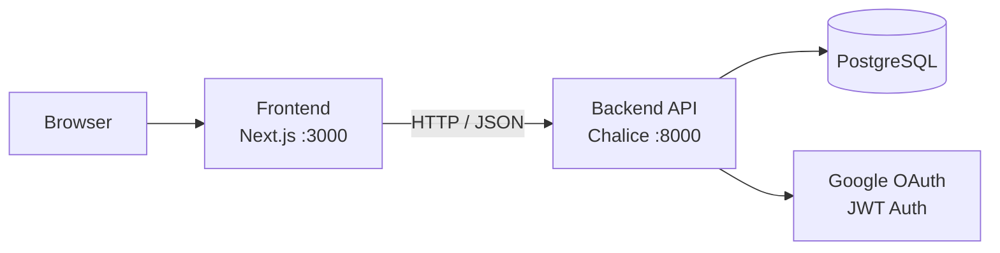

# GUNDAM UNIVERSE BOARD

> A community board with a Gundam Universal Century theme. Built with a Next.js frontend, AWS Chalice Python API, and PostgreSQL. Authentication is handled via Google OAuth and JWT.

[](https://nodejs.org)
[](https://www.python.org)
[](https://nextjs.org)
[](https://aws.amazon.com)
[](https://www.postgresql.org)
[](LICENSE)

[한국어](README.md) | **English** | [日本語](README.ja.md)

## Overview

GUNDAM UNIVERSE BOARD is a community application covering post creation, comments, authentication, and permission management. The frontend and backend are decoupled; the API and data model are managed alongside their documentation.

## Features

- Google OAuth-based login
- JWT access tokens and refresh token rotation
- Post CRUD with pagination
- Hierarchical comment system (1-level nested replies)
- Author-only edit and delete permissions
- Next.js App Router UI

## Tech Stack

| Layer | Technology |
|---|---|
| Frontend | Next.js 14, React 18, TypeScript, Tailwind CSS, Axios |
| Backend | AWS Chalice, Python 3.13, SQLAlchemy 2, PyJWT, google-auth |
| Database | PostgreSQL 15+, psycopg2 |

## Architecture



## Project Structure

```
ToyProject-Gundam/
├── backend/                    # AWS Chalice backend
│   ├── app.py                  # Application entry point
│   ├── requirements.txt
│   ├── Dockerfile
│   ├── .env.example
│   └── chalicelib/
│       ├── config.py           # Environment config and CORS
│       ├── database.py         # SQLAlchemy session management
│       ├── auth/
│       │   ├── google.py       # Google OAuth token verification
│       │   ├── tokens.py       # JWT encode / decode
│       │   └── middleware.py   # @require_auth decorator
│       ├── models/             # SQLAlchemy ORM models
│       ├── routes/             # API endpoint handlers
│       ├── serializers/        # Response formatting
│       └── utils/              # Pagination, validation
├── frontend/                   # Next.js frontend
│   ├── Dockerfile
│   ├── .env.local.example
│   └── src/
│       ├── app/                # App Router pages
│       ├── components/         # Reusable UI components
│       ├── hooks/useAuth.ts    # Auth state hook
│       ├── services/api.ts     # Axios client + interceptors
│       └── types/index.ts      # TypeScript interfaces
├── docs/                       # Design and API documentation
├── docker-compose.yml
└── .github/workflows/ci.yml
```

## Quick Start

### Requirements

- Node.js 22.20.0 or higher
- Python 3.13 or higher
- PostgreSQL 15 or higher
- Google OAuth client ID

### Backend

```powershell
cd backend
python -m venv venv
.\venv\Scripts\Activate.ps1
pip install -r requirements.txt
copy .env.example .env
chalice local --port 8000
```

`.env` requires at minimum: `DATABASE_URL`, `JWT_SECRET`, `GOOGLE_CLIENT_ID`, `GOOGLE_CLIENT_SECRET`.

### Frontend

```powershell
cd frontend
npm install
copy .env.local.example .env.local
npm run dev
```

Set `NEXT_PUBLIC_API_URL=http://localhost:8000` and `NEXT_PUBLIC_GOOGLE_CLIENT_ID` in `.env.local`.

### Access

- Frontend: `http://localhost:3000`
- Backend: `http://localhost:8000`

For detailed setup, see [docs/LOCAL_SETUP_GUIDE.en.md](docs/LOCAL_SETUP_GUIDE.en.md).

## Environment Variables

| File | Variable | Description |
|---|---|---|
| `backend/.env` | `DATABASE_URL` | PostgreSQL connection string |
| `backend/.env` | `JWT_SECRET` | JWT signing key |
| `backend/.env` | `GOOGLE_CLIENT_ID` | Google OAuth client ID |
| `backend/.env` | `GOOGLE_CLIENT_SECRET` | Google OAuth client secret |
| `backend/.env` | `CORS_ALLOWED_ORIGINS` | Comma-separated allowed origins |
| `frontend/.env.local` | `NEXT_PUBLIC_API_URL` | Backend API base URL |
| `frontend/.env.local` | `NEXT_PUBLIC_GOOGLE_CLIENT_ID` | Google client ID for login |

## Docker

Run the full stack locally from the project root:

```powershell
docker compose up --build
```

| Service | URL |
|---|---|
| Frontend | `http://localhost:3000` |
| Backend | `http://localhost:8000` |
| PostgreSQL | `localhost:5432` |

`docker-compose.yml` orchestrates PostgreSQL, backend, and frontend. The backend exposes a `/health` endpoint; the frontend waits for it to be healthy before starting. Override `JWT_SECRET`, `GOOGLE_CLIENT_ID`, or `NEXT_PUBLIC_GOOGLE_CLIENT_ID` via environment variables before running.

## Documentation

| Document | Description |
|---|---|
| [docs/LOCAL_SETUP_GUIDE.en.md](docs/LOCAL_SETUP_GUIDE.en.md) | Local setup and environment configuration |
| [docs/01_API_Design.md](docs/01_API_Design.md) | API specification |
| [docs/02_Database_Design.md](docs/02_Database_Design.md) | Database schema design |
| [docs/03_Frontend_Architecture.md](docs/03_Frontend_Architecture.md) | Frontend structure |
| [docs/04_Backend_Architecture.md](docs/04_Backend_Architecture.md) | Backend structure |
| [docs/05_UI_UX_Design.md](docs/05_UI_UX_Design.md) | UI/UX guide |
| [docs/ENGINEERING_AUDIT_REPORT.md](docs/ENGINEERING_AUDIT_REPORT.md) | Code audit report |

## Deployment

```powershell
cd backend
chalice deploy --stage dev
chalice deploy --stage prod
```

Configure environment variables, logging, monitoring, and backup policies separately before a production deploy.

## Release

Releases are created from `v*` tags.

```powershell
git tag v1.0.0
git push origin v1.0.0
```

Pushing a tag triggers [`.github/workflows/release.yml`](.github/workflows/release.yml):

- GitHub Release is created with auto-generated release notes and `docker-compose.yml` attached
- Backend and frontend Docker images are built and pushed to GitHub Container Registry

## Package

Container images are published to [GitHub Container Registry](https://ghcr.io).

| Image | Tags |
|---|---|
| `ghcr.io/salieri009/toyproject-gundam-backend` | `latest`, `v1.0.0` |
| `ghcr.io/salieri009/toyproject-gundam-frontend` | `latest`, `v1.0.0` |

To run using pre-built images, replace the `build:` blocks in `docker-compose.yml` with `image:`:

```yaml
backend:
  image: ghcr.io/salieri009/toyproject-gundam-backend:latest

frontend:
  image: ghcr.io/salieri009/toyproject-gundam-frontend:latest
```

> The frontend image has `NEXT_PUBLIC_API_URL=http://localhost:8000` baked in at build time. A custom build is required when deploying to a different domain.

## License

This project is licensed under the MIT License. See [LICENSE](LICENSE) for details.
