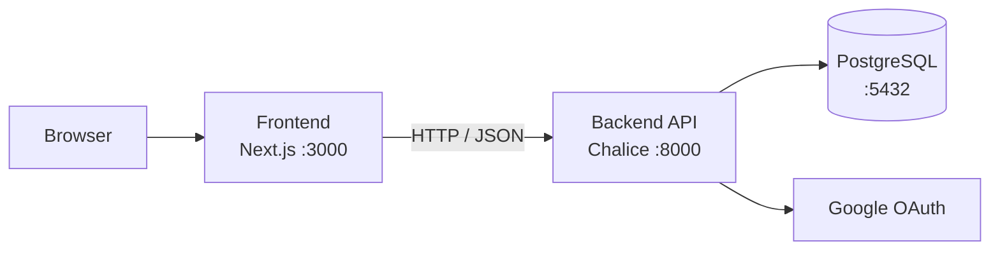

<div align="center">

# GUNDAM UNIVERSE BOARD

**ガンダム宇宙世紀テーマのフルスタック・コミュニティプラットフォーム**

*2025年夏休み（6月）に個人学習を目的として開発したトイプロジェクト*

<br />

[](https://github.com/salieri009/ToyProject-Gundam/actions/workflows/ci.yml)
[](https://github.com/salieri009/ToyProject-Gundam/releases)
[](LICENSE)

<br />

[](https://nodejs.org)
[](https://www.python.org)
[](https://nextjs.org)
[](https://www.typescriptlang.org)
[](https://tailwindcss.com)
[](https://www.postgresql.org)
[](https://aws.amazon.com/lambda/)
[](https://docs.docker.com/compose/)

<br />

[한국어](README.md) · [English](README.en.md) · **日本語**

</div>

---

## 目次

- [概要](#概要)
- [主な機能](#主な機能)
- [技術スタック](#技術スタック)
- [アーキテクチャ](#アーキテクチャ)
- [プロジェクト構造](#プロジェクト構造)
- [クイックスタート](#クイックスタート)
- [環境変数](#環境変数)
- [Docker](#docker)
- [ドキュメント](#ドキュメント)
- [デプロイ](#デプロイ)
- [Release](#release)
- [Package](#package)
- [ライセンス](#ライセンス)

---

## 概要

大学の休暇期間中に個人学習を目的として開発したトイプロジェクトです。

GUNDAM UNIVERSE BOARD は、投稿作成・コメント・認証・権限管理を備えたコミュニティアプリケーションです。フロントエンドとバックエンドを分離し、API とデータモデルはドキュメントと合わせて管理しています。

---

## 主な機能

| 機能 | 説明 |
|---|---|
| 🔐 **Google OAuth ログイン** | Google アカウントで簡単ログイン |
| 🔑 **JWT 認証** | アクセストークン (24h) + リフレッシュトークン (30d) 自動更新 |
| 📝 **投稿 CRUD** | 作成・一覧 (ページネーション) ・更新・削除 |
| 💬 **階層型コメント** | コメント + 1段階ネスト返信 |
| 🛡️ **権限制御** | 自分の投稿・コメントのみ編集・削除可能 |
| 📱 **レスポンシブ UI** | Next.js App Router + Tailwind CSS |

---

## 技術スタック

### Frontend

| 項目 | 技術 | バージョン |
|---|---|---|
| Framework | Next.js (App Router) | 14 |
| Language | TypeScript | 5 |
| Styling | Tailwind CSS | 3 |
| HTTP Client | Axios | 1.6 |
| Auth | @react-oauth/google | 0.12 |
| Forms | React Hook Form + Zod | 7 / 3 |

### Backend

| 項目 | 技術 | バージョン |
|---|---|---|
| Framework | AWS Chalice | 1.29 |
| Language | Python | 3.13 |
| ORM | SQLAlchemy + psycopg2 | 2.0 |
| Auth | PyJWT + google-auth | 2.8 / 2.23 |

### Infrastructure

| 項目 | 技術 |
|---|---|
| Database | PostgreSQL 15 |
| Container | Docker + Docker Compose |
| CI/CD | GitHub Actions |
| Registry | GitHub Container Registry (GHCR) |
| Cloud | AWS Lambda + API Gateway |

---

## アーキテクチャ



**認証フロー**

```
1. ユーザー → Google OAuth ログイン
2. バックエンド → JWT アクセストークン (24h) + リフレッシュトークン (30d) 発行
3. フロントエンド → Axios インターセプターが全リクエストに Bearer トークンを自動付与
4. トークン期限切れ → /auth/refresh を自動呼び出し → 新しいアクセストークン発行
5. ログアウト → クライアントのトークン削除 + リフレッシュトークン無効化
```

---

## プロジェクト構造

```
ToyProject-Gundam/
├── backend/                    # AWS Chalice バックエンド
│   ├── app.py                  # アプリケーションエントリーポイント
│   ├── requirements.txt
│   ├── Dockerfile
│   ├── .env.example
│   └── chalicelib/
│       ├── config.py           # 環境設定と CORS
│       ├── database.py         # SQLAlchemy セッション管理
│       ├── auth/
│       │   ├── google.py       # Google OAuth トークン検証
│       │   ├── tokens.py       # JWT エンコード / デコード
│       │   └── middleware.py   # @require_auth デコレーター
│       ├── models/             # SQLAlchemy ORM モデル
│       ├── routes/             # API エンドポイントハンドラー
│       ├── serializers/        # レスポンスフォーマット
│       └── utils/              # ページネーション、バリデーション
├── frontend/                   # Next.js フロントエンド
│   ├── Dockerfile
│   ├── .env.local.example
│   └── src/
│       ├── app/                # App Router ページ
│       ├── components/         # 再利用可能な UI コンポーネント
│       ├── hooks/useAuth.ts    # 認証状態フック
│       ├── services/api.ts     # Axios クライアント + インターセプター
│       └── types/index.ts      # TypeScript インターフェース
├── docs/                       # 設計・API ドキュメント
├── docker-compose.yml
└── .github/
    ├── workflows/ci.yml        # リント・ビルド CI
    └── workflows/release.yml   # リリース・イメージパブリッシュ
```

---

## クイックスタート

### 要件

- Node.js 22 以上
- Python 3.13 以上
- PostgreSQL 15 以上
- Google OAuth クライアント ID / シークレット

### 1. バックエンド

```bash
cd backend
python -m venv venv
source venv/bin/activate        # Windows: .\venv\Scripts\Activate.ps1
pip install -r requirements.txt
cp .env.example .env
# .env に DATABASE_URL, JWT_SECRET, GOOGLE_CLIENT_ID, GOOGLE_CLIENT_SECRET を設定
chalice local --port 8000
```

### 2. フロントエンド

```bash
cd frontend
npm install
cp .env.local.example .env.local
# .env.local に NEXT_PUBLIC_API_URL, NEXT_PUBLIC_GOOGLE_CLIENT_ID を設定
npm run dev
```

### 3. アクセス

| サービス | URL |
|---|---|
| Frontend | http://localhost:3000 |
| Backend | http://localhost:8000 |

> 詳細なセットアップ手順は [docs/LOCAL_SETUP_GUIDE.ja.md](docs/LOCAL_SETUP_GUIDE.ja.md) を参照してください。

---

## 環境変数

### `backend/.env`

| 変数 | 必須 | 説明 |
|---|:---:|---|
| `DATABASE_URL` | ✅ | PostgreSQL 接続文字列 |
| `JWT_SECRET` | ✅ | JWT 署名キー (十分な長さのランダム文字列) |
| `GOOGLE_CLIENT_ID` | ✅ | Google OAuth クライアント ID |
| `GOOGLE_CLIENT_SECRET` | ✅ | Google OAuth クライアントシークレット |
| `CORS_ALLOWED_ORIGINS` | | 許可する Origin のカンマ区切りリスト (デフォルト: `http://localhost:3000`) |

### `frontend/.env.local`

| 変数 | 必須 | 説明 |
|---|:---:|---|
| `NEXT_PUBLIC_API_URL` | ✅ | バックエンド API ベース URL |
| `NEXT_PUBLIC_GOOGLE_CLIENT_ID` | ✅ | Google ログイン用クライアント ID |

---

## Docker

全スタック (PostgreSQL + Backend + Frontend) を一括起動します。

```bash
# ビルドして起動
docker compose up --build

# バックグラウンド起動
docker compose up -d --build

# 停止
docker compose down
```

| サービス | URL |
|---|---|
| Frontend | http://localhost:3000 |
| Backend API | http://localhost:8000 |
| PostgreSQL | localhost:5432 |

> Backend は `/health` エンドポイントで状態を公開します。Frontend は Backend が healthy になってから起動します。

環境変数をオーバーライドして起動する場合：

```bash
JWT_SECRET=your-secret \
GOOGLE_CLIENT_ID=your-client-id \
NEXT_PUBLIC_GOOGLE_CLIENT_ID=your-client-id \
docker compose up --build
```

---

## ドキュメント

| ドキュメント | 説明 |
|---|---|
| [docs/LOCAL_SETUP_GUIDE.ja.md](docs/LOCAL_SETUP_GUIDE.ja.md) | ローカル実行・環境設定の全手順 |
| [docs/01_API_Design.md](docs/01_API_Design.md) | REST API 仕様 (エンドポイント・リクエスト・レスポンス) |
| [docs/02_Database_Design.md](docs/02_Database_Design.md) | データベーススキーマと関係設計 |
| [docs/03_Frontend_Architecture.md](docs/03_Frontend_Architecture.md) | コンポーネント構造・状態管理 |
| [docs/04_Backend_Architecture.md](docs/04_Backend_Architecture.md) | バックエンドレイヤー・ルート・ミドルウェア |
| [docs/05_UI_UX_Design.md](docs/05_UI_UX_Design.md) | CRT レトロテーマ UI/UX ガイド |
| [docs/ENGINEERING_AUDIT_REPORT.md](docs/ENGINEERING_AUDIT_REPORT.md) | コード監査レポート |

---

## デプロイ

AWS Chalice を使用して Lambda + API Gateway にデプロイします。

```bash
cd backend
chalice deploy --stage dev   # 開発環境
chalice deploy --stage prod  # 本番環境
```

> 本番デプロイ前に環境変数・ロギング・モニタリング・バックアップポリシーを別途設定してください。

---

## Release

[](https://github.com/salieri009/ToyProject-Gundam/releases)

`v*` タグをプッシュすると [`.github/workflows/release.yml`](.github/workflows/release.yml) が自動実行されます。

```bash
git tag v1.0.0
git push origin v1.0.0
```

**自動処理内容**

- GitHub Release 作成 (リリースノート自動生成、`docker-compose.yml` 添付)
- Backend / Frontend Docker イメージをビルドして GHCR にパブリッシュ

---

## Package

[](https://github.com/salieri009/ToyProject-Gundam/pkgs/container/toyproject-gundam-backend)
[](https://github.com/salieri009/ToyProject-Gundam/pkgs/container/toyproject-gundam-frontend)

コンテナイメージは [GitHub Container Registry](https://ghcr.io) に公開されます。

| イメージ | タグ |
|---|---|
| `ghcr.io/salieri009/toyproject-gundam-backend` | `latest`, `v1.0.0` |
| `ghcr.io/salieri009/toyproject-gundam-frontend` | `latest`, `v1.0.0` |

**イメージの Pull**

```bash
docker pull ghcr.io/salieri009/toyproject-gundam-backend:latest
docker pull ghcr.io/salieri009/toyproject-gundam-frontend:latest
```

**ビルド済みイメージで実行** — `docker-compose.yml` の `build:` ブロックを `image:` に置き換えてください。

```yaml
backend:
  image: ghcr.io/salieri009/toyproject-gundam-backend:latest

frontend:
  image: ghcr.io/salieri009/toyproject-gundam-frontend:latest
```

> Frontend イメージは `NEXT_PUBLIC_API_URL=http://localhost:8000` がビルド時に固定されます。別のドメインにデプロイする場合は独自ビルドが必要です。

---

## ライセンス

このプロジェクトは MIT ライセンスに従います。詳細は [LICENSE](LICENSE) を確認してください。
