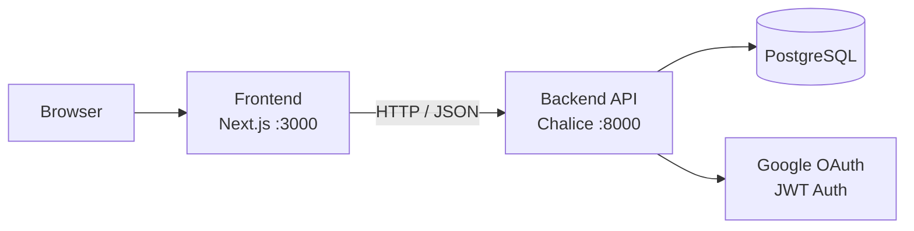

# GUNDAM UNIVERSE BOARD

> ガンダム宇宙世紀テーマのコミュニティ掲示板です。Next.js フロントエンド、AWS Chalice ベースの Python API、PostgreSQL を使用し、Google OAuth と JWT で認証を処理します。

[](https://nodejs.org)
[](https://www.python.org)
[](https://nextjs.org)
[](https://aws.amazon.com)
[](https://www.postgresql.org)
[](LICENSE)

[한국어](README.md) | [English](README.en.md) | **日本語**

## 概要

GUNDAM UNIVERSE BOARD は、投稿作成・コメント・認証・権限管理を備えたコミュニティアプリケーションです。フロントエンドとバックエンドを分離し、API とデータモデルはドキュメントと合わせて管理しています。

## 主な機能

- Google OAuth ベースのログイン
- JWT アクセストークンとリフレッシュトークンのローテーション
- ページネーション付き投稿 CRUD
- 階層型コメントシステム（1 段階ネスト返信）
- 本人のみ編集・削除可能な権限制御
- Next.js App Router ベースの UI

## 技術スタック

| レイヤー | 技術 |
|---|---|
| Frontend | Next.js 14, React 18, TypeScript, Tailwind CSS, Axios |
| Backend | AWS Chalice, Python 3.13, SQLAlchemy 2, PyJWT, google-auth |
| Database | PostgreSQL 15+, psycopg2 |

## アーキテクチャ



## プロジェクト構造

```
ToyProject-Gundam/
├── backend/                    # AWS Chalice バックエンド
│   ├── app.py                  # アプリケーションエントリーポイント
│   ├── requirements.txt
│   ├── Dockerfile
│   ├── .env.example
│   └── chalicelib/
│       ├── config.py           # 環境設定と CORS
│       ├── database.py         # SQLAlchemy セッション管理
│       ├── auth/
│       │   ├── google.py       # Google OAuth トークン検証
│       │   ├── tokens.py       # JWT エンコード / デコード
│       │   └── middleware.py   # @require_auth デコレーター
│       ├── models/             # SQLAlchemy ORM モデル
│       ├── routes/             # API エンドポイントハンドラー
│       ├── serializers/        # レスポンスフォーマット
│       └── utils/              # ページネーション、バリデーション
├── frontend/                   # Next.js フロントエンド
│   ├── Dockerfile
│   ├── .env.local.example
│   └── src/
│       ├── app/                # App Router ページ
│       ├── components/         # 再利用可能な UI コンポーネント
│       ├── hooks/useAuth.ts    # 認証状態フック
│       ├── services/api.ts     # Axios クライアント + インターセプター
│       └── types/index.ts      # TypeScript インターフェース
├── docs/                       # 設計・API ドキュメント
├── docker-compose.yml
└── .github/workflows/ci.yml
```

## クイックスタート

### 要件

- Node.js 22.20.0 以上
- Python 3.13 以上
- PostgreSQL 15 以上
- Google OAuth クライアント ID

### バックエンド

```powershell
cd backend
python -m venv venv
.\venv\Scripts\Activate.ps1
pip install -r requirements.txt
copy .env.example .env
chalice local --port 8000
```

`.env` には最低限 `DATABASE_URL`、`JWT_SECRET`、`GOOGLE_CLIENT_ID`、`GOOGLE_CLIENT_SECRET` を設定してください。

### フロントエンド

```powershell
cd frontend
npm install
copy .env.local.example .env.local
npm run dev
```

`.env.local` に `NEXT_PUBLIC_API_URL=http://localhost:8000` と `NEXT_PUBLIC_GOOGLE_CLIENT_ID` を設定します。

### アクセス

- Frontend: `http://localhost:3000`
- Backend: `http://localhost:8000`

詳細なセットアップは [docs/LOCAL_SETUP_GUIDE.ja.md](docs/LOCAL_SETUP_GUIDE.ja.md) を参照してください。

## 環境変数

| ファイル | 変数 | 説明 |
|---|---|---|
| `backend/.env` | `DATABASE_URL` | PostgreSQL 接続文字列 |
| `backend/.env` | `JWT_SECRET` | JWT 署名キー |
| `backend/.env` | `GOOGLE_CLIENT_ID` | Google OAuth クライアント ID |
| `backend/.env` | `GOOGLE_CLIENT_SECRET` | Google OAuth クライアントシークレット |
| `backend/.env` | `CORS_ALLOWED_ORIGINS` | 許可するオリジンのカンマ区切りリスト |
| `frontend/.env.local` | `NEXT_PUBLIC_API_URL` | バックエンド API ベース URL |
| `frontend/.env.local` | `NEXT_PUBLIC_GOOGLE_CLIENT_ID` | Google ログイン用クライアント ID |

## Docker

プロジェクトルートから全スタックをローカルで起動します：

```powershell
docker compose up --build
```

| サービス | URL |
|---|---|
| Frontend | `http://localhost:3000` |
| Backend | `http://localhost:8000` |
| PostgreSQL | `localhost:5432` |

`docker-compose.yml` は PostgreSQL・backend・frontend を統合管理します。backend は `/health` エンドポイントを公開し、frontend はそれが正常になってから起動します。実行前に `JWT_SECRET`、`GOOGLE_CLIENT_ID`、`NEXT_PUBLIC_GOOGLE_CLIENT_ID` を環境変数で上書きしてください。

## ドキュメント

| ドキュメント | 説明 |
|---|---|
| [docs/LOCAL_SETUP_GUIDE.ja.md](docs/LOCAL_SETUP_GUIDE.ja.md) | ローカル実行と環境設定 |
| [docs/01_API_Design.md](docs/01_API_Design.md) | API 仕様 |
| [docs/02_Database_Design.md](docs/02_Database_Design.md) | データベース設計 |
| [docs/03_Frontend_Architecture.md](docs/03_Frontend_Architecture.md) | フロントエンド構造 |
| [docs/04_Backend_Architecture.md](docs/04_Backend_Architecture.md) | バックエンド構造 |
| [docs/05_UI_UX_Design.md](docs/05_UI_UX_Design.md) | UI/UX ガイド |
| [docs/ENGINEERING_AUDIT_REPORT.md](docs/ENGINEERING_AUDIT_REPORT.md) | コード監査レポート |

## デプロイ

```powershell
cd backend
chalice deploy --stage dev
chalice deploy --stage prod
```

本番デプロイ前に、環境変数・ロギング・モニタリング・バックアップポリシーを個別に設定してください。

## リリース

リリースは `v*` タグを基準に作成されます。

```powershell
git tag v1.0.0
git push origin v1.0.0
```

タグをプッシュすると [`.github/workflows/release.yml`](.github/workflows/release.yml) が実行されます。

- GitHub Release が自動生成（リリースノート自動作成、`docker-compose.yml` 添付）
- backend/frontend Docker イメージを GitHub Container Registry にビルド・プッシュ

## パッケージ

コンテナイメージは [GitHub Container Registry](https://ghcr.io) に公開されます。

| イメージ | タグ |
|---|---|
| `ghcr.io/salieri009/toyproject-gundam-backend` | `latest`, `v1.0.0` |
| `ghcr.io/salieri009/toyproject-gundam-frontend` | `latest`, `v1.0.0` |

ビルド済みイメージを使って起動するには、`docker-compose.yml` の `build:` ブロックを `image:` に置き換えてください。

```yaml
backend:
  image: ghcr.io/salieri009/toyproject-gundam-backend:latest

frontend:
  image: ghcr.io/salieri009/toyproject-gundam-frontend:latest
```

> frontend イメージは `NEXT_PUBLIC_API_URL=http://localhost:8000` がビルド時に固定されます。別のドメインにデプロイする場合は独自のビルドが必要です。

## ライセンス

このプロジェクトは MIT ライセンスに従います。詳細は [LICENSE](LICENSE) を確認してください。
