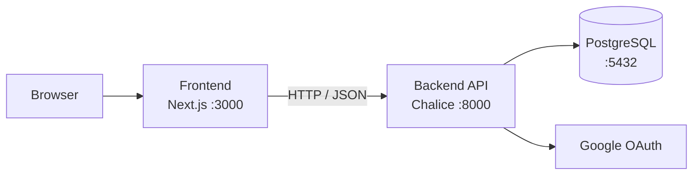

<div align="center">

# GUNDAM UNIVERSE BOARD

**건담 우주세기 팬을 위한 풀스택 커뮤니티 플랫폼**

*대학교 방학 기간에 개인 학습 목적으로 개발한 토이 프로젝트*

<br />

[](https://github.com/salieri009/ToyProject-Gundam/actions/workflows/ci.yml)
[](https://github.com/salieri009/ToyProject-Gundam/releases)
[](LICENSE)

<br />

[](https://nodejs.org)
[](https://www.python.org)
[](https://nextjs.org)
[](https://www.typescriptlang.org)
[](https://tailwindcss.com)
[](https://www.postgresql.org)
[](https://aws.amazon.com/lambda/)
[](https://docs.docker.com/compose/)

<br />

[**한국어**](README.md) · [English](README.en.md) · [日本語](README.ja.md)

</div>

---

## 목차

- [개요](#개요)
- [주요 기능](#주요-기능)
- [기술 스택](#기술-스택)
- [아키텍처](#아키텍처)
- [프로젝트 구조](#프로젝트-구조)
- [빠른 시작](#빠른-시작)
- [환경 변수](#환경-변수)
- [Docker](#docker)
- [문서](#문서)
- [배포](#배포)
- [Release](#release)
- [Package](#package)
- [라이선스](#라이선스)

---

## 개요

대학교 방학 기간 동안 개인 학습 목적으로 개발한 토이 프로젝트입니다.

GUNDAM UNIVERSE BOARD는 게시글 작성, 댓글, 인증, 권한 관리를 포함한 커뮤니티 애플리케이션입니다. 프론트엔드와 백엔드를 분리했고, API와 데이터 모델은 문서와 함께 관리합니다.

---

## 주요 기능

| 기능 | 설명 |
|---|---|
| 🔐 **Google OAuth 로그인** | Google 계정으로 간편 로그인 |
| 🔑 **JWT 인증** | 액세스 토큰(24h) + 리프레시 토큰(30d) 자동 갱신 |
| 📝 **게시글 CRUD** | 작성·조회(페이지네이션)·수정·삭제 |
| 💬 **계층형 댓글** | 댓글 + 대댓글 1단계 중첩 구조 |
| 🛡️ **권한 제어** | 본인 게시물·댓글만 수정·삭제 가능 |
| 📱 **반응형 UI** | Next.js App Router + Tailwind CSS 기반 |

---

## 기술 스택

### Frontend

| 항목 | 기술 | 버전 |
|---|---|---|
| Framework | Next.js (App Router) | 14 |
| Language | TypeScript | 5 |
| Styling | Tailwind CSS | 3 |
| HTTP Client | Axios | 1.6 |
| Auth | @react-oauth/google | 0.12 |
| Forms | React Hook Form + Zod | 7 / 3 |

### Backend

| 항목 | 기술 | 버전 |
|---|---|---|
| Framework | AWS Chalice | 1.29 |
| Language | Python | 3.13 |
| ORM | SQLAlchemy + psycopg2 | 2.0 |
| Auth | PyJWT + google-auth | 2.8 / 2.23 |

### Infrastructure

| 항목 | 기술 |
|---|---|
| Database | PostgreSQL 15 |
| Container | Docker + Docker Compose |
| CI/CD | GitHub Actions |
| Registry | GitHub Container Registry (GHCR) |
| Cloud | AWS Lambda + API Gateway |

---

## 아키텍처



**인증 흐름**

```
1. 사용자 → Google OAuth 로그인
2. 백엔드 → JWT access token (24h) + refresh token (30d) 발급
3. 프론트엔드 → Axios 인터셉터가 모든 요청에 Bearer 토큰 자동 주입
4. 토큰 만료 → /auth/refresh 자동 호출 → 새 access token 발급
5. 로그아웃 → 클라이언트 토큰 삭제 + refresh token 무효화
```

---

## 프로젝트 구조

```
ToyProject-Gundam/
├── backend/                    # AWS Chalice 백엔드
│   ├── app.py                  # 애플리케이션 진입점
│   ├── requirements.txt
│   ├── Dockerfile
│   ├── .env.example
│   └── chalicelib/
│       ├── config.py           # 환경 설정 및 CORS
│       ├── database.py         # SQLAlchemy 세션 관리
│       ├── auth/
│       │   ├── google.py       # Google OAuth 토큰 검증
│       │   ├── tokens.py       # JWT 인코드 / 디코드
│       │   └── middleware.py   # @require_auth 데코레이터
│       ├── models/             # SQLAlchemy ORM 모델
│       ├── routes/             # API 엔드포인트 핸들러
│       ├── serializers/        # 응답 포맷
│       └── utils/              # 페이지네이션, 입력 검증
├── frontend/                   # Next.js 프론트엔드
│   ├── Dockerfile
│   ├── .env.local.example
│   └── src/
│       ├── app/                # App Router 페이지
│       ├── components/         # 재사용 가능한 UI 컴포넌트
│       ├── hooks/useAuth.ts    # 인증 상태 훅
│       ├── services/api.ts     # Axios 클라이언트 + 인터셉터
│       └── types/index.ts      # TypeScript 인터페이스
├── docs/                       # 설계 및 API 문서
├── docker-compose.yml
└── .github/
    ├── workflows/ci.yml        # 린트 · 빌드 CI
    └── workflows/release.yml   # 릴리스 · 이미지 퍼블리시
```

---

## 빠른 시작

### 요구사항

- Node.js 22 이상
- Python 3.13 이상
- PostgreSQL 15 이상
- Google OAuth 클라이언트 ID/시크릿

### 1. 백엔드

```powershell
cd backend
python -m venv venv
.\venv\Scripts\Activate.ps1
pip install -r requirements.txt
copy .env.example .env
# .env 에 DATABASE_URL, JWT_SECRET, GOOGLE_CLIENT_ID, GOOGLE_CLIENT_SECRET 입력
chalice local --port 8000
```

### 2. 프론트엔드

```powershell
cd frontend
npm install
copy .env.local.example .env.local
# .env.local 에 NEXT_PUBLIC_API_URL, NEXT_PUBLIC_GOOGLE_CLIENT_ID 입력
npm run dev
```

### 3. 접속

| 서비스 | URL |
|---|---|
| Frontend | http://localhost:3000 |
| Backend | http://localhost:8000 |

> 전체 설정 방법은 [docs/LOCAL_SETUP_GUIDE.md](docs/LOCAL_SETUP_GUIDE.md)를 참고하세요.

---

## 환경 변수

### `backend/.env`

| 변수 | 필수 | 설명 |
|---|:---:|---|
| `DATABASE_URL` | ✅ | PostgreSQL 연결 문자열 |
| `JWT_SECRET` | ✅ | JWT 서명 키 (충분히 긴 랜덤 문자열) |
| `GOOGLE_CLIENT_ID` | ✅ | Google OAuth 클라이언트 ID |
| `GOOGLE_CLIENT_SECRET` | ✅ | Google OAuth 클라이언트 시크릿 |
| `CORS_ALLOWED_ORIGINS` | | 허용할 Origin 목록 (기본: `http://localhost:3000`) |

### `frontend/.env.local`

| 변수 | 필수 | 설명 |
|---|:---:|---|
| `NEXT_PUBLIC_API_URL` | ✅ | 백엔드 API 주소 |
| `NEXT_PUBLIC_GOOGLE_CLIENT_ID` | ✅ | Google 로그인에 사용할 클라이언트 ID |

---

## Docker

전체 스택(PostgreSQL + Backend + Frontend)을 한 번에 실행합니다.

```powershell
# 이미지 빌드 후 실행
docker compose up --build

# 백그라운드 실행
docker compose up -d --build

# 종료
docker compose down
```

| 서비스 | URL |
|---|---|
| Frontend | http://localhost:3000 |
| Backend API | http://localhost:8000 |
| PostgreSQL | localhost:5432 |

> Backend는 `/health` 엔드포인트로 상태를 노출합니다. Frontend는 Backend가 healthy 상태가 된 이후에 시작됩니다.

환경 변수를 오버라이드하려면 실행 전에 지정하세요.

```powershell
$env:JWT_SECRET="your-secret"
$env:GOOGLE_CLIENT_ID="your-client-id"
$env:NEXT_PUBLIC_GOOGLE_CLIENT_ID="your-client-id"
docker compose up --build
```

---

## 문서

| 문서 | 설명 |
|---|---|
| [docs/LOCAL_SETUP_GUIDE.md](docs/LOCAL_SETUP_GUIDE.md) | 로컬 실행 및 환경 설정 전체 가이드 |
| [docs/01_API_Design.md](docs/01_API_Design.md) | REST API 명세 (엔드포인트·요청·응답) |
| [docs/02_Database_Design.md](docs/02_Database_Design.md) | 데이터베이스 스키마 및 관계 설계 |
| [docs/03_Frontend_Architecture.md](docs/03_Frontend_Architecture.md) | 프론트엔드 컴포넌트 구조·상태 관리 |
| [docs/04_Backend_Architecture.md](docs/04_Backend_Architecture.md) | 백엔드 레이어·라우트·미들웨어 |
| [docs/05_UI_UX_Design.md](docs/05_UI_UX_Design.md) | CRT 레트로 테마 UI/UX 가이드 |
| [docs/ENGINEERING_AUDIT_REPORT.md](docs/ENGINEERING_AUDIT_REPORT.md) | 코드 감사 리포트 |

---

## 배포

AWS Chalice를 사용해 Lambda + API Gateway에 배포합니다.

```powershell
cd backend
chalice deploy --stage dev   # 개발 환경
chalice deploy --stage prod  # 운영 환경
```

> 운영 배포 전에 환경 변수, 로깅, 모니터링, 백업 정책을 별도로 설정하세요.

---

## Release

[](https://github.com/salieri009/ToyProject-Gundam/releases)

`v*` 태그를 푸시하면 [`.github/workflows/release.yml`](.github/workflows/release.yml)이 자동 실행됩니다.

```powershell
git tag v1.0.0
git push origin v1.0.0
```

**자동 처리 내용**

- GitHub Release 생성 (릴리스 노트 자동 작성, `docker-compose.yml` 첨부)
- Backend / Frontend Docker 이미지 빌드 후 GHCR 퍼블리시

---

## Package

[](https://github.com/salieri009/ToyProject-Gundam/pkgs/container/toyproject-gundam-backend)
[](https://github.com/salieri009/ToyProject-Gundam/pkgs/container/toyproject-gundam-frontend)

컨테이너 이미지는 [GitHub Container Registry](https://ghcr.io)에 게시됩니다.

| 이미지 | 태그 |
|---|---|
| `ghcr.io/salieri009/toyproject-gundam-backend` | `latest`, `v1.0.0` |
| `ghcr.io/salieri009/toyproject-gundam-frontend` | `latest`, `v1.0.0` |

**이미지 Pull**

```bash
docker pull ghcr.io/salieri009/toyproject-gundam-backend:latest
docker pull ghcr.io/salieri009/toyproject-gundam-frontend:latest
```

**사전 빌드 이미지로 실행** — `docker-compose.yml`의 `build:` 블록을 `image:`로 교체하세요.

```yaml
backend:
  image: ghcr.io/salieri009/toyproject-gundam-backend:latest

frontend:
  image: ghcr.io/salieri009/toyproject-gundam-frontend:latest
```

> Frontend 이미지는 `NEXT_PUBLIC_API_URL=http://localhost:8000`이 빌드 시 고정됩니다. 다른 도메인에 배포할 경우 직접 빌드가 필요합니다.

---

## 라이선스

이 프로젝트는 MIT 라이선스를 따릅니다. 자세한 내용은 [LICENSE](LICENSE)를 확인하세요.
