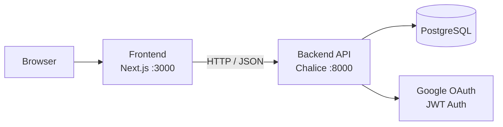

# GUNDAM UNIVERSE BOARD

> 건담 우주세기 테마의 게시판 서비스입니다. Next.js 프론트엔드, AWS Chalice 기반 Python API, PostgreSQL을 사용하고 Google OAuth와 JWT로 인증을 처리합니다.

[](https://nodejs.org)
[](https://www.python.org)
[](https://nextjs.org)
[](https://aws.amazon.com)
[](https://www.postgresql.org)
[](LICENSE)

[한국어](README.md) | [English](README.en.md) | [日本語](README.ja.md)

## 개요

GUNDAM UNIVERSE BOARD는 게시글 작성, 댓글, 인증, 권한 관리를 포함한 커뮤니티 애플리케이션입니다. 프론트엔드와 백엔드를 분리했고, API와 데이터 모델은 문서와 함께 관리합니다.

## 주요 기능

- Google OAuth 기반 로그인
- JWT 액세스 토큰과 리프레시 토큰 처리
- 게시글 CRUD와 페이지네이션
- 계층형 댓글 구조
- 본인 게시물만 수정/삭제하는 권한 제어
- Next.js App Router 기반 UI

## 기술 스택

| 구분 | 기술 |
|---|---|
| Frontend | Next.js 14, React 18, TypeScript, Tailwind CSS, Axios |
| Backend | AWS Chalice, Python 3.13, SQLAlchemy 2, PyJWT, google-auth |
| Database | PostgreSQL 15+, psycopg2 |

## 아키텍처



## 프로젝트 구조

- `backend/`: Chalice 엔트리포인트, 인증, 모델, 라우트, DB 설정
- `frontend/`: App Router 페이지, 공통 컴포넌트, 훅, API 클라이언트
- `docs/`: API, DB, UI/UX, 아키텍처, 로컬 실행 문서

## 빠른 시작

### 요구사항

- Node.js 22.20.0 이상
- Python 3.13 이상
- PostgreSQL 15 이상
- Google OAuth 클라이언트 ID

### 백엔드

```powershell
cd backend
python -m venv venv
.\venv\Scripts\Activate.ps1
pip install -r requirements.txt
copy .env.example .env
chalice local --port 8000
```

`.env`에는 최소한 `DATABASE_URL`, `JWT_SECRET`, `GOOGLE_CLIENT_ID`, `GOOGLE_CLIENT_SECRET`을 넣어야 합니다.

### 프론트엔드

```powershell
cd frontend
npm install
copy .env.local.example .env.local
npm run dev
```

`.env.local`에는 `NEXT_PUBLIC_API_URL=http://localhost:8000`, `NEXT_PUBLIC_GOOGLE_CLIENT_ID`를 설정합니다.

### 접속 주소

- Frontend: `http://localhost:3000`
- Backend: `http://localhost:8000`

자세한 설정은 [docs/LOCAL_SETUP_GUIDE.md](docs/LOCAL_SETUP_GUIDE.md)를 참고하세요.

## 환경 변수

| 파일 | 변수 | 설명 |
|---|---|---|
| `backend/.env` | `DATABASE_URL` | PostgreSQL 연결 문자열 |
| `backend/.env` | `JWT_SECRET` | JWT 서명 키 |
| `backend/.env` | `GOOGLE_CLIENT_ID` | Google OAuth 클라이언트 ID |
| `backend/.env` | `GOOGLE_CLIENT_SECRET` | Google OAuth 클라이언트 시크릿 |
| `backend/.env` | `CORS_ALLOWED_ORIGINS` | 허용할 프론트엔드 Origin 목록 |
| `frontend/.env.local` | `NEXT_PUBLIC_API_URL` | 백엔드 API 주소 |
| `frontend/.env.local` | `NEXT_PUBLIC_GOOGLE_CLIENT_ID` | Google 로그인에 사용할 클라이언트 ID |

## 문서

| 문서 | 설명 |
|---|---|
| [docs/LOCAL_SETUP_GUIDE.md](docs/LOCAL_SETUP_GUIDE.md) | 로컬 실행 및 환경 설정 |
| [docs/01_API_Design.md](docs/01_API_Design.md) | API 명세 |
| [docs/02_Database_Design.md](docs/02_Database_Design.md) | 데이터베이스 설계 |
| [docs/03_Frontend_Architecture.md](docs/03_Frontend_Architecture.md) | 프론트엔드 구조 |
| [docs/04_Backend_Architecture.md](docs/04_Backend_Architecture.md) | 백엔드 구조 |
| [docs/05_UI_UX_Design.md](docs/05_UI_UX_Design.md) | UI/UX 가이드 |
| [docs/ENGINEERING_AUDIT_REPORT.md](docs/ENGINEERING_AUDIT_REPORT.md) | 코드 감사 리포트 |

## 배포

```powershell
cd backend
chalice deploy --stage dev
chalice deploy --stage prod
```

운영 배포 전에는 환경 변수, 로깅, 모니터링, 백업 정책을 분리해서 설정하세요.

## Docker

로컬에서 전체 스택을 실행하려면 루트에서 다음 명령을 사용하세요.

```powershell
docker compose up --build
```

실행 후 접속 주소는 다음과 같습니다.

- Frontend: `http://localhost:3000`
- Backend: `http://localhost:8000`
- PostgreSQL: `localhost:5432`

`docker-compose.yml`은 PostgreSQL, backend, frontend를 함께 올립니다. JWT나 Google OAuth 값을 바꾸려면 실행 전에 환경 변수를 지정하세요.

## Release

릴리스는 `v*` 태그를 기준으로 만듭니다.

```powershell
git tag v1.0.0
git push origin v1.0.0
```

태그를 푸시하면 GitHub Release가 생성되고, backend/frontend Docker 이미지가 GitHub Container Registry에 올라갑니다.

## 라이선스

이 프로젝트는 MIT 라이선스를 따릅니다. 자세한 내용은 [LICENSE](LICENSE)를 확인하세요.
